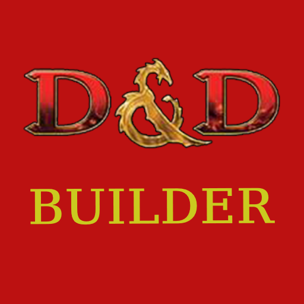

  

  <h3 align="center">D&D Builder</h3>
  <h4 align="center">Angel Rivas Nieto</h4>
  <h4 align="center">2º DAM</h4>

  

   Creador de personajes para d&d 4º Edicion
     
 

## Sobre el proyecto

D&D Builder es una aplicacion de android cuya funcion es crear y guardar 
personajes de la 4º edicion de d&d

## Tecnologias utilizadas
* C#
* Xamarin Forms
* SQLite

## Commits
- [07/10/2022]Creacion del proyecto
- [10/10/2022]Creacion del la pantalla principal
- [12/10/2022]Creacion de la pantalla razas
- [19/10/2022]Cambios en la pantalla raza y pantalla principal
- [03/11/2022]Cambios en la pantalla raza, creacion de la clase Personajes y creacion de la clase Clase
- [08/11/2022]Se añadieron las imajenes que apareceran en la pantalla Raza y se termino
- [11/11/2022]Cambios en la pantalla Clase y terminada
- [14/11/2022]Creacion de la pantalla Personaje final
- [17/11/2022]Creacion de la pantalla ListaJugadores, VerJugador y SQLiteHelper(Todas terminadas)
- [19/11/2022]Se añadio las imagenes que aparecen en la pantalla Clase, se añadio toda la informacion a la clase Personajes, se modifico el aspecto de la pantalla pricipal, Verjugador y ListaJugadores
- [19/11/2022]Se añadio el logo a la aplicacion
